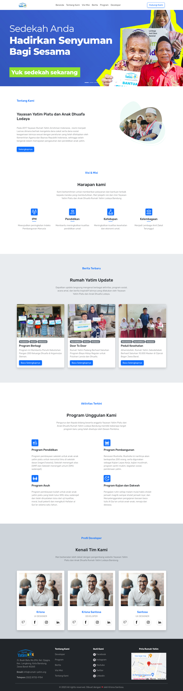

# 🌟 Website Yayasan Lodaya

Welcome to **Website Yayasan Lodaya**! 🚀

### Link: [Website Yayasan Lodaya](https://krisnasantosa15.github.io/yayasan-lodaya/)

Open Source Website for Yayasan Lodaya, Bandung. This project is built with HTML, CSS, and JavaScript. This project is built with the help of [Bootstrap](https://getbootstrap.com/), [SVG Repo](https://www.svgrepo.com/), and [Google Fonts](https://fonts.google.com/).

## 📚 About

Hey there! Thanks for checking out **Website Yayasan Lodaya**. This project is all information about Yayasan Rumah yatim Lodaya, Bandung. Our main goal is to give the visitor information about the latest news, programs, etc. about Yayasan Lodaya. 😉

## ✨ Features

Here are the key features that make **Website Yayasan Lodaya** shine:

- ✨ Programs: Latest Activities of Yayasan Lodaya
- ✨ News: Latest News of Yayasan Lodaya
- ✨ Information: Information about Yayasan Lodaya

## 📸 Screenshots

Here are overviews of **Website Yayasan Lodaya**:

## 🚀 Getting Started

Ready to get started with **Website Yayasan Lodaya**? Follow these simple steps:

### Prerequisites

Make sure you have the following things set up before continuing:

- Internet
- Live Server Extension (for Visual Studio Code)

### Installation

1. Clone the repository: `git clone https://github.com/KrisnaSantosa15/yayasan-lodaya.git`
2. Open the project in your favorite code editor (I recommend [Visual Studio Code](https://code.visualstudio.com/))
3. Run the project in your browser with live server extension, and voila! 🎉

## 🤝 Contributing

We'd love your contribution to make **Website Yayasan Lodaya** even better! Here's how you can help:

1. Fork the project
2. Create your feature branch: `git checkout -b feature/AmazingFeature`
3. Commit your changes: `git commit -m 'Add some amazing feature'`
4. Push to the branch: `git push origin feature/AmazingFeature`
5. Open a pull request

## 📄 License

**Website Yayasan Lodaya** is distributed under the [MIT License](LICENSE.md). See the `LICENSE.md` file for more information.

## 📧 Contact

Have any questions or suggestions? Feel free to reach out!

- Email: mamang.krisna15@gmail.com
- GitHub: [KrisnaSantosa15](https://github.com/KrisnaSantosa15)

We're excited to hear from you! Let's build something amazing together! 🎉

---